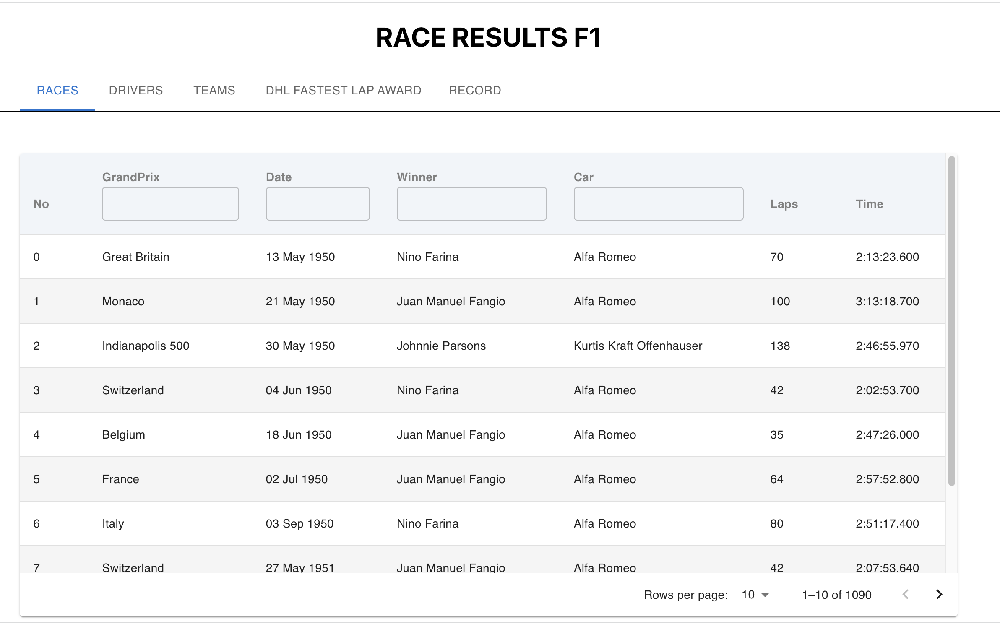
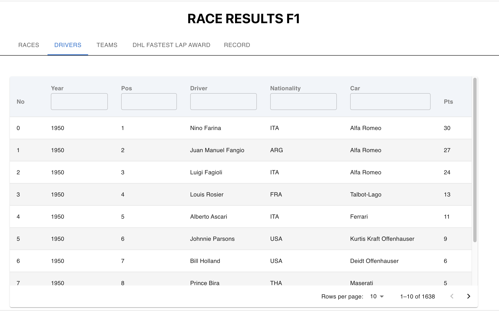
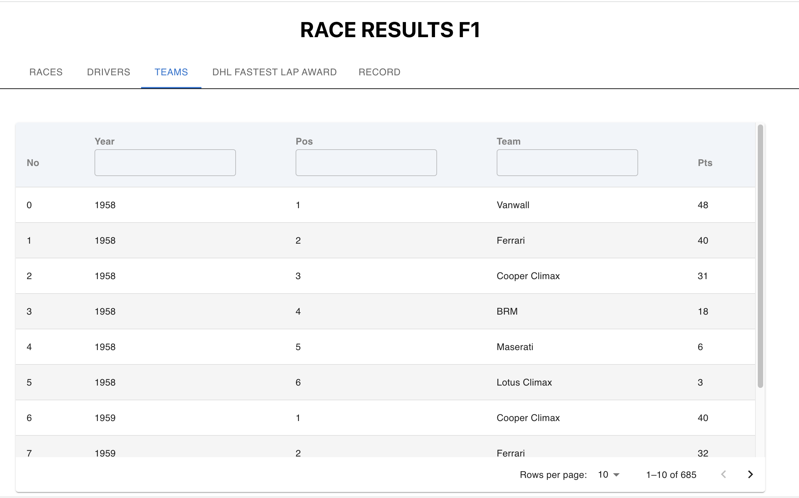
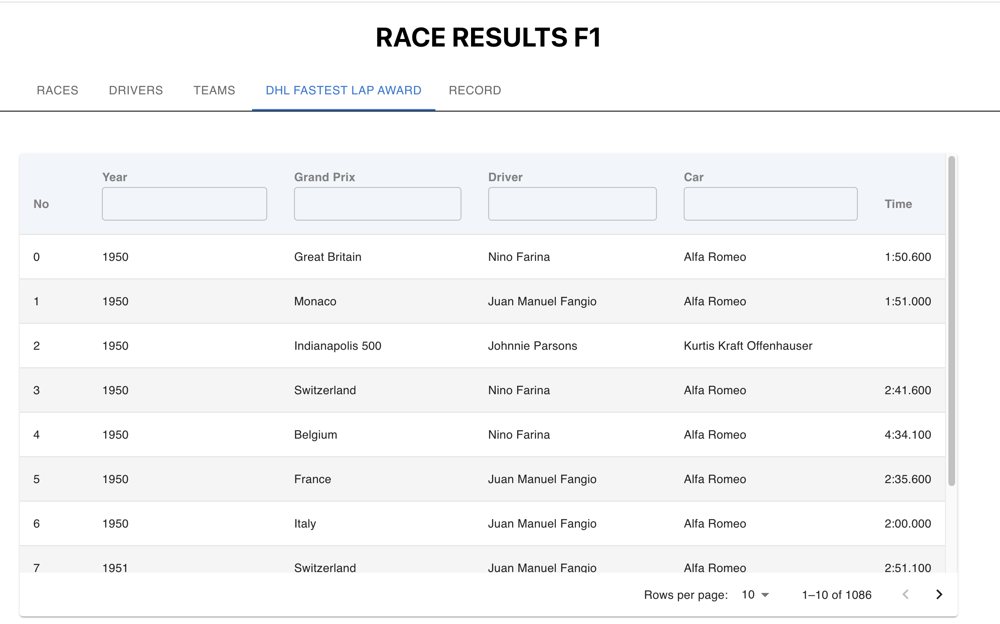
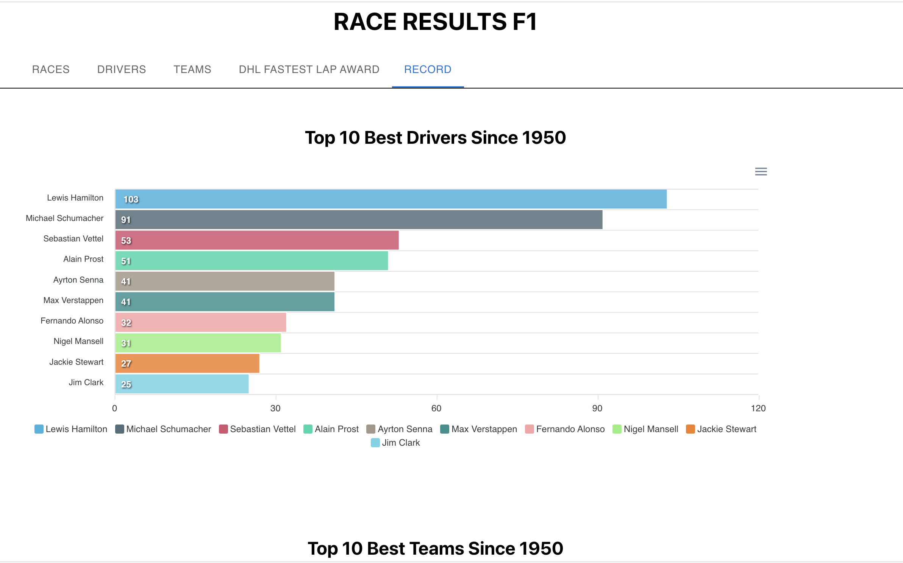

## I . Implementation process
- Craw data : get Csv file from https://www.kaggle.com/datasets/aadiltajani/fia-f1-19502019-data and save at `public/dataset` folder
- Implement UI using `React TypeScript`, `Material UI`, `apexcharts`
- Deploy product on vercel.com
- link github: https://github.com/JosVuHuynh/race-results
- link Production: https://race-results-mb2c72r4r-josvuhuynh.vercel.app/

### II. Features
There are 5 Tab in Product:
- The first Tab is RACES: display table of races result 1950 - 2023, User can search by GrandPrix, Date, Winnner or Car.
  

- The second Tab is DRIVERS: display table of drivers result 1950 - 2023, User can search by Year, Position, Driver, Nationality or Car.
  

- The third Tab is TEAMS: display table of teams result 1950 - 2023, User can search by Year, Position, Team.
  

- The fourth Tab is DH FASTED LAP AWARD : display table of fastest lap award 1950 - 2023 , User can search by Year, GrandPrix, Driver, Car.
  
 
- the Fifth Tab is Record: display chart of Top 10 best Drivers and best Teams since 1950.

## III. Running

- Clone repository:  `git clone https://github.com/JosVuHuynh/race-results.git`

- install pakages `npm install`

- run `npm start`

- go to `http://localhost:3000/` to see result
